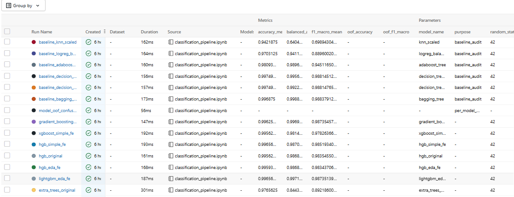
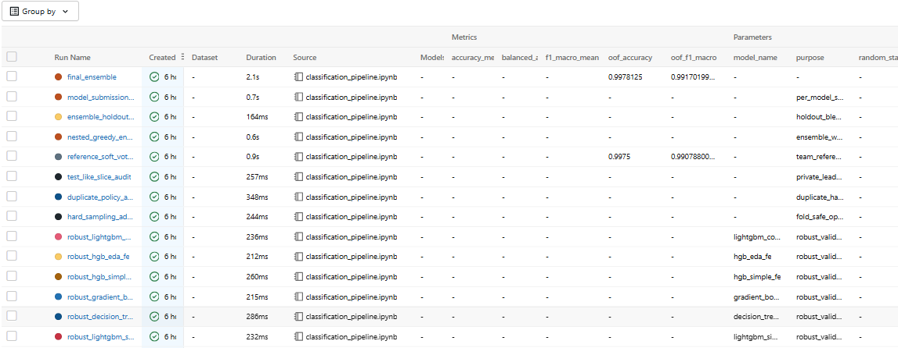

<div dir="rtl" align="right">

# تقرير MLOps - FITE Classification Challenge

## 1. فكرة المشروع

المشروع عبارة عن مسألة تصنيف متعدد الكلاسات على بيانات جدولية مجهولة المعنى. بما أن أسماء الخصائص لا تحمل معنى واضحاً، كان التركيز على بناء خط تدريب قابل للإعادة، وتجربة أكثر من نموذج، ثم توثيق النتائج بطريقة تسمح بمقارنة التجارب بدل الاعتماد على تجربة واحدة.

استخدمنا `Macro F1` كمقياس أساسي لأن توزيع الكلاسات غير متوازن. هذا المقياس يعطينا صورة أوضح عن أداء النموذج على كل كلاس، وليس فقط على الكلاس الأكبر.

## 2. منهجية التقييم

اعتمدنا على `StratifiedKFold` حتى تبقى نسب الكلاسات متقاربة داخل كل fold. لكل نموذج سجلنا:

- `Accuracy`
- `Balanced Accuracy`
- `Macro F1`
- اسم النموذج والإعدادات الأساسية
- نتائج إضافية للـ ensemble مثل `OOF Macro F1`

بهذا الشكل أصبح القرار مبنياً على مقارنة داخلية واضحة بين النماذج، وليس على رقم واحد فقط.

## 3. تتبع التجارب باستخدام MLflow

تم دمج `MLflow` داخل كود التدريب. كل تجربة يتم تسجيلها كـ run مستقل يحتوي على اسم النموذج، الهدف من التجربة، المقاييس، وبعض الملفات الناتجة عند الحاجة.

لفتح لوحة MLflow محلياً:

```bash
mlflow ui --backend-store-uri sqlite:///mlflow.db
```

ثم فتح الرابط:

```text
http://127.0.0.1:5000
```

الصورة التالية تعرض مجموعة من التجارب المسجلة، مع مقاييس المقارنة الأساسية مثل `accuracy_mean` و`balanced_accuracy_mean` و`f1_macro_mean`.



الصورة التالية تعرض تجارب الـ ensemble والفحوصات الإضافية مثل `final_ensemble` و`reference_soft_voting_candidate`، وفيها تظهر مقاييس `oof_accuracy` و`oof_f1_macro`.



## 4. التجارب التي تمت مقارنتها

جربنا عدة عائلات من النماذج حتى لا يكون الاختيار مبنياً على نموذج واحد فقط:

| نوع التجربة | الهدف |
|---|---|
| Decision Tree و Bagging | اختبار قدرة الأشجار على التقاط الأنماط الواضحة في الخصائص |
| Random Forest و Extra Trees | تقليل تذبذب الشجرة الواحدة عبر تجميع عدة أشجار |
| Gradient Boosting و HistGradientBoosting | تجربة نماذج boosting مناسبة للبيانات الجدولية |
| LightGBM و XGBoost | اختبار نماذج قوية على tabular data |
| Unweighted LightGBM | مقارنة أثر إزالة class weights |
| Core 4 Features Model | اختبار نموذج صغير يعتمد على أكثر الخصائص ظهوراً في التحليل |
| ADASYN و BorderlineSMOTE | فحص أثر توليد أمثلة إضافية للفئات الأقل عدداً |
| Soft Voting Ensemble | دمج احتمالات عدة نماذج عندما تكون أخطاؤها مختلفة |

الهدف من هذه التجارب لم يكن فقط رفع النتيجة، بل معرفة أي النماذج أكثر ثباتاً وأيها يعطي أداء جيداً على الكلاسات الأقل عدداً.

## 5. إدارة البيانات باستخدام DVC

استخدمنا `DVC` لتتبع ملفات البيانات بدل رفع ملفات CSV الخام إلى GitHub. هذا يجعل المستودع أخف، ويعطي طريقة واضحة لأي عضو في الفريق ليسترجع نفس نسخة البيانات.

رابط مستودع GitHub:

```text
https://github.com/AhmadMurad10/FITE-Classification-Challenge
```

الـ DVC remote مضبوط على Google Drive:

```text
gdrive://12AfjjB_qMloHxg0oZsQ4fbWs3zYJCeAo
```

لاسترجاع البيانات على جهاز جديد:

```bash
pip install -r requirements.txt
dvc pull
```

يجب أن يكون لدى المستخدم صلاحية وصول إلى فولدر Google Drive قبل تنفيذ `dvc pull`.

## 6. خلاصة

تم بناء pipeline قابل للإعادة، وتسجيل التجارب باستخدام `MLflow`، وتتبع البيانات باستخدام `DVC`. كما تمت مقارنة عدة نماذج ومقاييس بدل الاعتماد على نتيجة واحدة. هذا يعطينا توثيقاً واضحاً لكيفية الوصول إلى النموذج النهائي، ويسهّل مراجعة التجارب أو إعادة تشغيلها لاحقاً.

</div>
